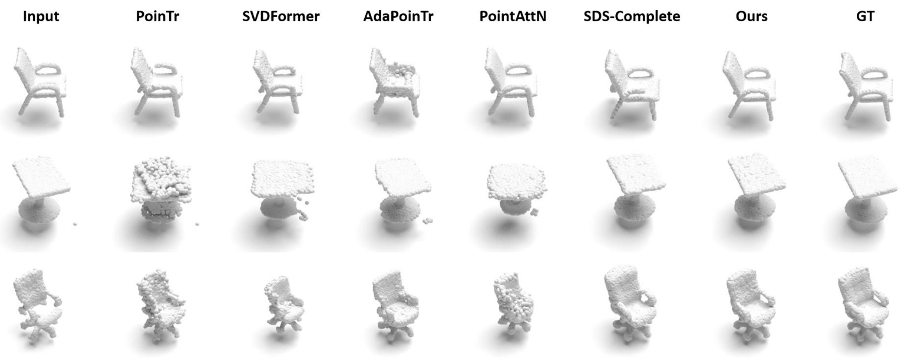

# ComPC

> ComPC: Completing a 3D Point Cloud with 2D Diffusion Priors  
> Tianxin Huang, Zhiwen Yan, Yuyang Zhao, Gim Hee Lee  
> ICLR'25



[My Personal Page :)](https://tianxinhuang.github.io/) | [Our Project Page :)](https://tianxinhuang.github.io/projects/ComPC)

## TODO List and ETA
- [x] Evaluation Data.

- [x] Codes for Optimization.


## Installation
We suggest to use Anaconda for configuration:

1. Clone/download this repositry, create a new conda env: 

```
conda create -n compc python=3.10.13
```

and then activate it by (`conda activate deface`)

2. Install Cuda 11.6 by: 

```
conda install -c "nvidia/label/cuda-11.6.0" cuda
```

In case that there is the error "fatal error: cusparse.h: No such file or directory":

```
conda install -c conda-forge cudatoolkit-dev
```

In case that there is the error "error: parameter packs not expanded with '...'":

```
apt install gcc-10 g++-10 -y
export CC=/usr/bin/gcc-10
export CXX=/usr/bin/g++-10
```

3. Install Torch by running:

```
pip install torch==1.12.1+cu116 torchvision==0.13.1+cu116 torchaudio==0.12.1 --extra-index-url https://download.pytorch.org/whl/cu116
```

4. Install other packages by running: 

```
pip install -r requirements.txt
```

5. Download the synthetic and redwood [data](https://drive.google.com/drive/folders/1Ce2xk6kpTkKG-vKbtcsEs2JiJTmdiYaD?usp=drive_link), and run the codes for completion.

## How to Use

Just replace following dirs with your own ones, and run the optimization with:

```
python test.py --config your_config_yaml --workdir your_workdir_for_intermediate_files --indir your_input_directory --outdir your_output_dir --name your_data_name
```

We have provided config files for our evaluation data in the (`configs`) dir. You can also adjust the hyper-parameters on your own. We believe that the performances can be further improved by adjusting the parameters.

For example, if you want to conduct experiments on single images from Voxceleb2 downloaded in (`synthetic_redwood/synthetic`), the command to optimize would be:

```
python test.py --config configs/synthetic.yaml --workdir workspace --indir synthetic_redwood --outdir result_dir --name synthetic
```


After running the optimization, you can evaluate the performances by:

```
python eval_metrics.py --dataset dataset_type --resdir your_respath --result_dir your_result.txt
```

Then, the quantitative results would be written into the (`--result_dir`).


## Citation

If you find our work useful, please cite:

```bibtex
@article{huang2024compc,
  title={ComPC: Completing a 3D Point Cloud with 2D Diffusion Priors},
  author={Huang, Tianxin and Yan, Zhiwen and Zhao, Yuyang and Lee, Gim Hee},
  journal={arXiv preprint arXiv:2404.06814},
  year={2024}
}
```

```bibtex
@article{tang2023dreamgaussian,
  title={Dreamgaussian: Generative gaussian splatting for efficient 3d content creation},
  author={Tang, Jiaxiang and Ren, Jiawei and Zhou, Hang and Liu, Ziwei and Zeng, Gang},
  journal={arXiv preprint arXiv:2309.16653},
  year={2023}
}
```

# Acknowledgements
We built our source codes based on [DreamGaussian](https://github.com/dreamgaussian/dreamgaussian). The main differences lie on the processing for 3D Geometry. DreamGaussian focuses on recovering and extracting meshes from the text or image input, while our method concentrates on predicting uniform point clouds distributed on the 3D surfaces from partial points.   

# contact 
mail: 21725129 @at zju.edu.cn
